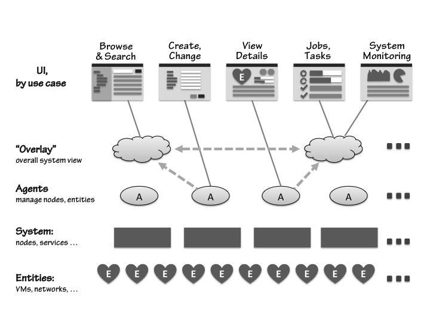
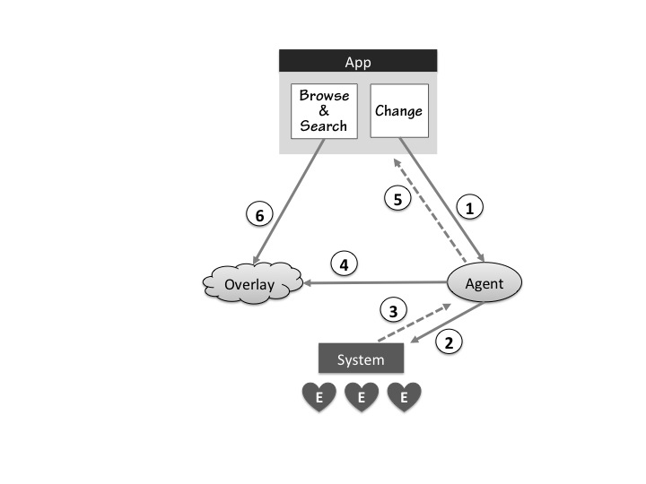
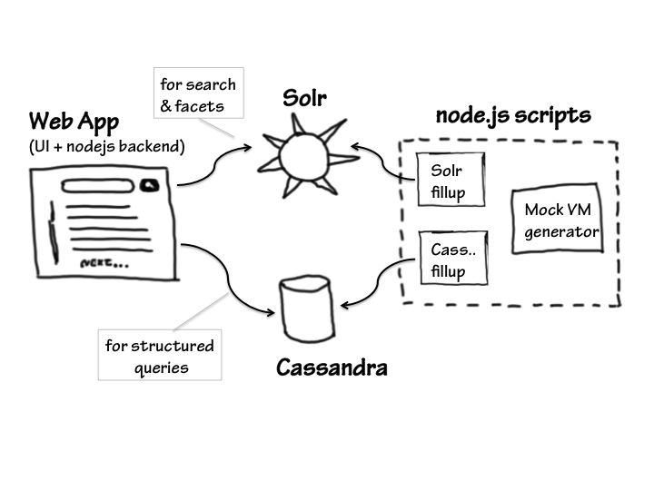

# VM Search with Cassandra and Solr
#Big idea 

Different UIs serve different use cases, and pose very different requirements on the underlying architecture. In system management software the key UIs are 

* Browse & Search
* Details - entity details, including metrics for this entity
* Change
* Tasks - running tasks/history, per user/per entity/all
* Monitor system 

More - Conrad's idea of 16 boxes, evolved. [TODO: ask permission to reference]

The management layer should scale out infinitely to manage 100,000 nodes and millions of entities. How to do this? Let's drive architecture by use cases, based on the UI taxonomy. E.g. navigation model, refresh model, consistency demands, latency tolerance differ by use cases. Different use cases (and UIs!) post different backend to serve efficiently.  Some better off serving directly by the node. Some require an overlay consolidating info from all nodes. 

# Small idea: Browse and Search @ scale 

## Requirements & Assumptions: 

* Scale: 100,000 nodes, millions of VMs - OpenStack today (Josh from Piston).
* Scale out horisontally, with the underlying system
* Availability
* Consistency: consistent for THE user within session, eventually consistent data.
* Live data: updates at # rate. Structure ~stable, stats - rapid, tasks - in between. Caused by user actions, other's actions, system changes - we all know it well.
* Management API of underlying system: on node, or on central service, with hooks to modify and get updates
* Shall a) initially collect and fill up the data b) keep them current c) drop and recreate at ~5min

## Conceptual design

1. Change UI fires "change" to agent, return task id
2. Agent calls "change" on system (System under management, SUM)
3. System reports "done" to Agent
4. Agent updates BigData 
5. Agent reports task id done to the user.
6. Browse UI gets consistent view

Means of communication: a) message queue b) remote calls (RPC, WS, REST, etc).

# Notes:
*  we may provide consistency by our app, itself. Zookeeper will help. 

# Research
Why looking at big data? It's trendy, admit it :) We don't have BIG DATA problem, but we need consistency and replication at scale.

Some general info on Big Data solution that might help: 

* [Good big picture][gbp] (http://kkovacs.eu/cassandra-vs-mongodb-vs-couchdb-vs-redis)
*  [HBase/Cassandra comparison biased towards Cassandra][HBvCass] 
* Good problem classification in ["Finding the Right Data Solution for Your Application"][RightSol]

Experimented with: 

* Cassandra - for attractive story on availability vs consistency, write performance, and frankly simple installation and excellent docs. Activity around it seem to peaked at 2011, and go down. 
* Solr - for reach search. http://lucene.apache.org/solr/

# Prototype & Demo

Frontend: Bootstrap, Angular.
Backend: node.js, express.js, node-cassandra-client, solr-client

# Results
## Cassandra

* installed, created db, learned admin tools and query lang (CQL) 
* 100,000 records (TODO: use BEGIN UNLOGGED BATCH to get 1M)
* Data disk footprint: 1Mb (!) - expect to be ~10Mb for 1M records - default /var/lib/cassandra/data/{$keyspace}
* solid documentation, hype peaked at 2011 and went down, thought forums are still active.
* good for structure and simple indexes (select * where x=y)
* for more complex queries, must implement indexes as Cf, and maintain their consistency by the app. 
* joins are off BIG DATA map, all right. 
* can't do partial search (vm_01* for vm_0100)
* TODO: didn't' try to run a cluster, *to set up cluster locally https://github.com/pcmanus/ccm
* TODO: Cassandra node recovery? They say it's manual?

## Solr 
* installed, defined  schema, filled docs in batches, query as you please.
* 1,000,000 docs inserted in 1.5 sec!!!
* Data disk footprint - 0.5G ( {$solr-home}/solr/data)
* Memory footprint 170Mb empty, 290Mb with 1M data, after few searches
* excellent for any search (learn types, schema, and query syntax)
* may work for structure, too (check Solandra Reuter's demo!)
* used as app, but typically it's embedded in Java app
* may be gives little on top of Lucene, should we use Lucene directly?
* ~~no [good] replication, no availability story.~~ Look at SolrCloud, and be aware of  Solandra (below)
  * SolrCloud - Solr 4x - gives partitioning, availability and replication, tested, it works. The prototype is switched to use it.

## Solandra and DataStrax Enterprise Search 
A hybrid of Solr and Cassandra to add availability. Solandra uses Cassandra as index storage, adding availability to Solr at performance penalty. Should be worse if Cassandra is used to store data, too. ES adds Lucene search to Cassandra DB.

If we only need Solr, Solandra would do. 
If we need both Solr and Cassandra, ES, or a custom solution, or look at ElasticSearch

# Next Steps
* Look at OpenStack & clarify assumption about System Under Management: integration points, infrastructure available (e.g. message bus), how to browse/get data/change, where to place agents.
* Beef up UI to learn Solr and Cassandra's limits. Browse (vm on host), Facets (power-on, tags), search
* ~~Look at SolrClout~~ (done, like, switched to use it)
* Closer look at [ElasticSearch] (http://www.elasticsearch.org/) 
  * we can switch implementation later, they're conceptually the same.
* "Live data" simulation: rapidly update data
* ~~Try Cassandra "crash" and restore scenarios.~~ forget Cassandra for now. It's no good for relations. May return to it for time series.
* Crash scenario: deploy simulation on multiple nodes, crash one node, see that it continues to work. 

# References

[gbp]: (http://kkovacs.eu/cassandra-vs-mongodb-vs-couchdb-vs-redis)
[HBvCass]: http://ria101.wordpress.com/2010/02/24/hbase-vs-cassandra-why-we-moved/
[Ebay]: http://www.ebaytechblog.com/2012/08/14/cassandra-data-modeling-best-practices-part-2/
[RightSol]: http://www.infoq.com/articles/perera-data-storage-haystack

